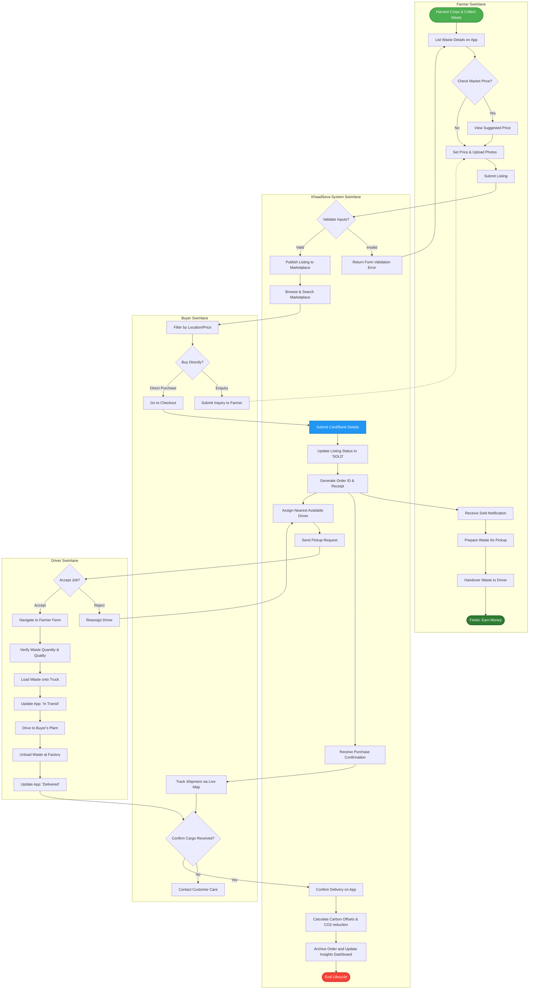

# UML Activity Diagram - KhaadSeva

This document provides an extensive elaboration of the **Activity Diagram** for the **KhaadSeva** platform. It details the step-by-step workflow of the platform, incorporating concurrent processes and decision splits across different user roles.

---

## 1. Workflow Scope & Business Logic
The activity diagram captures the lifecycle of agricultural waste, starting from a farmer harvesting crops and having leftover crop residue, up to the conversion of this residue into organic fertilizer.

Key elements modeled:
- **Listing Validation**: Form inputs, price assessment, and photo upload.
- **Purchase Processing**: Financial transactions and order creation.
- **Physical Logistics Flow**: Driver assignment, material collection, transit tracking, and final delivery verification.
- **Environmental Impact Updating**: Running parallel routines to recalculate CO₂ saved and waste recycled statistics.

---

## 2. Activity Diagram (Mermaid)

Below is the workflow diagram using Mermaid's flowchart format, with swimlanes modeled as separate subgraphs for **Farmer**, **KhaadSeva Platform**, **Buyer**, and **Logistics Driver**.

---

## 3. Key Activity Control Structures

### A. Decision Nodes (Diamonds)
1. **Check Suggested Price**: Allows farmers to view simulated market value dynamically.
2. **Direct Purchase vs. Enquiry**: Allows buyers to either purchase the listing instantly at full price or send a custom enquiry to negotiate terms.
3. **Accept/Reject Job**: Drivers have autonomy to reject a cargo shipment. The platform automatically catches rejection events and loops back to find alternative drivers.

### B. Parallel Processing (Concurrent Fork/Join)
- Upon successful delivery confirmation (`Confirm Delivery`):
  - **Path A**: The backend updates the database to release escrow payments to the Farmer (`CompleteFarmer`).
  - **Path B**: The system kicks off database aggregate queries in the background (`UpdateMetrics` & `Update CO₂ Reduction`) to reflect the newly recycled tonnages on the landing and impact pages.

---

## 4. Implementation Guidelines for Students
To code the logic outlined in the Activity Diagram:
- **Form Validation**: Build validation middleware in Express or NestJS (using `class-validator`) to ensure latitude/longitude data and positive integers for price are supplied during listing.
- **Geocoding**: Implement geolocation matching algorithms (like the *Haversine formula*) in the database query `AssignDriver` to identify drivers within a specific radius of the listing coordinates.
- **Task Queue**: Since recalculating global carbon analytics (`UpdateMetrics`) can be resource-intensive, offload this task to a background job worker (e.g., using BullMQ with Redis) to keep the primary HTTP response snappy.
