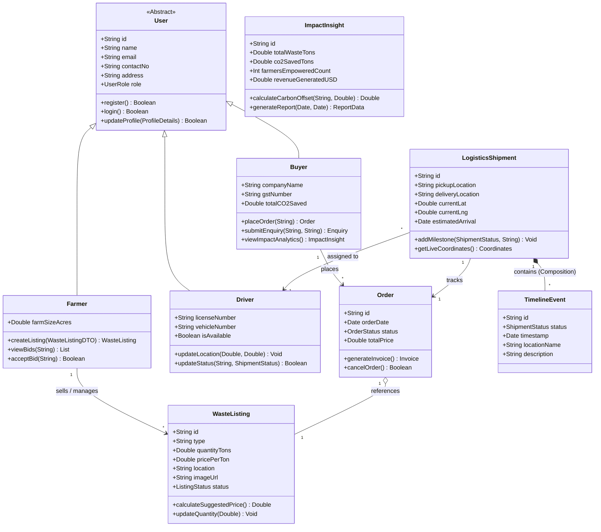

# UML Class Diagram - KhaadSeva

This document provides an extensive elaboration of the **Class Diagram** for the **KhaadSeva** platform. It defines the structural models, attributes, methods, and relationships required to support the application's domain logic.

---

## 1. Domain Modeling and Architecture
The class diagram follows an Object-Oriented Domain Driven Design. It reflects the structure of the system's database schema and backend models.

Key abstractions:
- **Users and Roles**: Utilizing generalization (inheritance) to represent different stakeholders (`Farmer`, `Buyer`, `Driver`, `Admin`) sharing common authentication and contact details in a base `User` class.
- **Marketplace Listings**: Modeling the `WasteListing` created by farmers.
- **Transactions & Lifecycle**: Modeling the transition of a listing to an `Order` and its shipping timeline through `LogisticsShipment` and `TimelineEvent`.
- **Analytics & Green Metrics**: The `ImpactInsight` class aggregates environmental footprints and financial transactions.

---

## 2. Class Definitions

### A. Core Actor Classes
#### `User` (Abstract)
- **Attributes**:
  - `id: String` (Unique identifier)
  - `name: String` (Full name)
  - `email: String` (Email address)
  - `contactNo: String` (Contact phone number)
  - `address: String` (Base address location)
  - `role: UserRole` (Enum: FARMER, BUYER, DRIVER, ADMIN)
- **Methods**:
  - `register(): Boolean`
  - `login(): Boolean`
  - `updateProfile(details: ProfileDetails): Boolean`

#### `Farmer` (Inherits from `User`)
- **Attributes**:
  - `farmSizeAcres: Double`
  - `listings: List<WasteListing>`
- **Methods**:
  - `createListing(listingData: WasteListingDTO): WasteListing`
  - `viewBids(listingId: String): List<Bid>`
  - `acceptBid(bidId: String): Boolean`

#### `Buyer` (Inherits from `User`)
- **Attributes**:
  - `companyName: String`
  - `gstNumber: String` (Tax identification)
  - `totalCO2Saved: Double`
- **Methods**:
  - `placeOrder(listingId: String): Order`
  - `submitEnquiry(listingId: String, query: String): Enquiry`
  - `viewImpactAnalytics(): ImpactInsight`

#### `Driver` (Inherits from `User`)
- **Attributes**:
  - `licenseNumber: String`
  - `vehicleNumber: String`
  - `isAvailable: Boolean`
- **Methods**:
  - `updateLocation(lat: Double, lng: Double): Void`
  - `updateStatus(shipmentId: String, status: ShipmentStatus): Boolean`

---

### B. Business Entity Classes
#### `WasteListing`
- **Attributes**:
  - `id: String`
  - `type: String` (e.g., Rice Husk, Sugarcane Bagasse)
  - `quantityTons: Double`
  - `pricePerTon: Double`
  - `location: String`
  - `imageUrl: String`
  - `status: ListingStatus` (Enum: ACTIVE, SOLD, EXPIRED)
  - `seller: Farmer` (Reference to listing owner)
- **Methods**:
  - `calculateSuggestedPrice(): Double`
  - `updateQuantity(newQty: Double): Void`

#### `Order`
- **Attributes**:
  - `id: String`
  - `orderDate: Date`
  - `status: OrderStatus` (Enum: PENDING, IN_TRANSIT, DELIVERED, CANCELLED)
  - `totalPrice: Double`
  - `listing: WasteListing` (1-to-1 association)
  - `buyer: Buyer` (Reference to buyer)
- **Methods**:
  - `generateInvoice(): Invoice`
  - `cancelOrder(): Boolean`

#### `LogisticsShipment`
- **Attributes**:
  - `id: String`
  - `order: Order` (1-to-1 association)
  - `driver: Driver`
  - `pickupLocation: String`
  - `deliveryLocation: String`
  - `currentLat: Double`
  - `currentLng: Double`
  - `estimatedArrival: Date`
  - `milestones: List<TimelineEvent>`
- **Methods**:
  - `addMilestone(status: ShipmentStatus, note: String): Void`
  - `getLiveCoordinates(): Coordinates`

#### `TimelineEvent`
- **Attributes**:
  - `id: String`
  - `status: ShipmentStatus`
  - `timestamp: Date`
  - `locationName: String`
  - `description: String`

#### `ImpactInsight`
- **Attributes**:
  - `id: String`
  - `totalWasteTons: Double`
  - `co2SavedTons: Double`
  - `farmersEmpoweredCount: Int`
  - `revenueGeneratedUSD: Double`
- **Methods**:
  - `calculateCarbonOffset(wasteType: String, tons: Double): Double`
  - `generateReport(startDate: Date, endDate: Date): ReportData`

---

## 3. Class Diagram (Mermaid)

Below is the structural class diagram. It illustrates inheritances, associations, aggregations, and compositions.

---

## 4. Relationship Explanations

1. **Generalization (`User` $\rightarrow$ `Farmer`, `Buyer`, `Driver`)**:
   - Reduces code redundancy by putting mutual details like name, email, and credentials in the `User` class.
2. **Association (`Farmer` $\rightarrow$ `WasteListing`)**:
   - A `Farmer` makes one or many `WasteListings`. The lifetime of the listing is dependent on the farmer but is not strictly a part-of relationship (aggregation/composition).
3. **Aggregation (`Order` $\rightarrow$ `WasteListing`)**:
   - An `Order` contains a reference to a `WasteListing`. If the order is deleted, the listing details might still exist in history; hence, it's represented as aggregation (open diamond).
4. **Composition (`LogisticsShipment` $\rightarrow$ `TimelineEvent`)**:
   - A shipment contains `TimelineEvents` (pickup, transit, border cross, delivery). If a `LogisticsShipment` is deleted, the associated tracking timeline milestones are deleted with it (filled diamond).

---

## 5. Implementation Guidelines for Students
To implement this diagram in a codebase:
- **TypeScript Interface Alignment**: Map `types.ts` to include inheritance schemas, or split them into models.
- **Relational Databases (SQL)**:
  - Implement **Single Table Inheritance** or **Class Table Inheritance** for `User`, `Farmer`, `Buyer`, and `Driver`.
  - Add foreign keys: `waste_listings.seller_id` referencing `users.id`, and `orders.listing_id` referencing `waste_listings.id`.
- **Object-Relational Mapping (ORM)**: If using Prisma or Mongoose, establish relationships (e.g. `Order` has one `WasteListing` and belongs to a `Buyer`).
