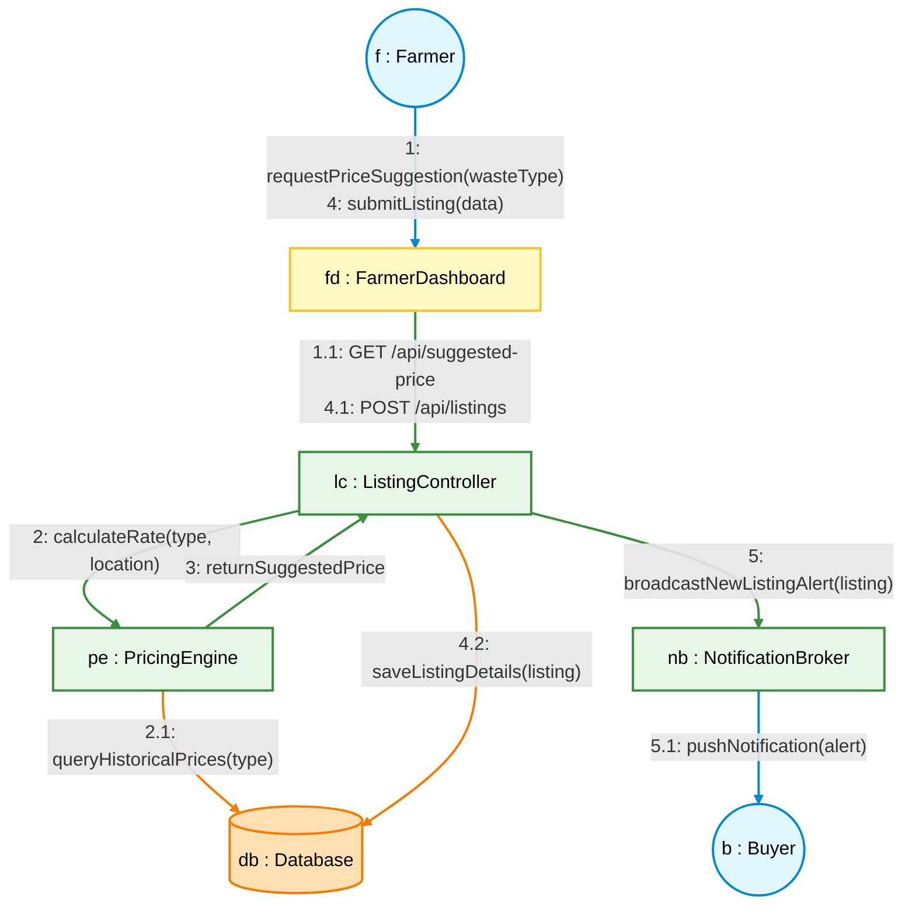

# UML Collaboration Diagram - KhaadSeva

This document provides an extensive elaboration of the **Collaboration Diagram** (also known as a **Communication Diagram** in UML 2.x) for the **KhaadSeva** platform. It focuses on the structural organization of objects that send and receive messages, rather than the temporal sequence.

---

## 1. Context and Scenario Description
A Collaboration Diagram shows the network of object interactions. This diagram models the **Marketplace Listing Creation & Pricing Consultation** workflow.

The scenario describes:
1. A **Farmer** requesting a suggested price for a waste crop residue and publishing a listing.
2. The internal services collaborating to fetch historical average prices and persist the record.
3. The platform pushing notifications to interested **Buyers** nearby.

---

## 2. Objects (Role Bindings) & Connectors

| Object Name | UML Representation | Description |
| :--- | :--- | :--- |
| **f : Farmer** | Actor Node | The farmer listing their bio-waste. |
| **fd : FarmerDashboard** | Boundary (UI) | Frontend interface that handles user input and displays recommendations. |
| **lc : ListingController** | Controller | REST API Endpoint controller that coordinates business transactions. |
| **pe : PricingEngine** | Service / Model | Algorithms calculating optimal market pricing based on historical data. |
| **db : Database** | Entity Store | Relational database containing marketplace listings and user coordinates. |
| **nb : NotificationBroker** | Service | Dispatch system that broadcasts alerts (WebSockets/Push) to matched users. |
| **b : Buyer** | Actor Node | Companies subscribing to specific raw materials in their region. |

---

## 3. Collaboration Diagram (Mermaid)

In a Collaboration/Communication Diagram, objects are nodes and links are lines between objects. The message numbers denote the execution order. Nested calls are shown using sub-numbering (e.g., `1.1`, `1.2`).

---

## 4. Detailed Message Sequence & Flow

1. **Step 1 & 1.1**: The `Farmer` enters the type of waste in the UI input box. The frontend sends an asynchronous query to the `ListingController` to evaluate the estimated valuation of the waste.
2. **Step 2 & 2.1**: The `ListingController` calls the `PricingEngine`. The `PricingEngine` executes a SQL/NoSQL query (`queryHistoricalPrices`) on the `Database` seeking the price metrics of completed transactions for that waste type in the same state/country over the last 90 days.
3. **Step 3**: The database returns price points, and `PricingEngine` calculates a median price adjusted for inflation and seasonal demand, returning it back to the `ListingController`.
4. **Step 4, 4.1 & 4.2**: The farmer reviews the suggested price ($125/ton), accepts or overrides it, and clicks "List Waste". The payload travels to the `ListingController`, which writes the new row to the listings table in the `Database`.
5. **Step 5 & 5.1**: Once written successfully, the controller invokes the `NotificationBroker`. The broker scans for `Buyers` who have set up alerts for "Rice Husk" or are located within 100km of the Farmer's location, sending them a push notification.

---

## 5. Implementation Guidelines for Students
To construct this software architecture:
- **Loose Coupling**: Program the backend Controllers (`ListingController`) against Interfaces rather than concrete implementations (e.g., depend on `IPricingService` instead of `PricingEngine`). This allows swapping calculation methods (such as AI models or simple averages) without touching the controllers.
- **WebSocket/Push Notifications**: Use Socket.io or Firebase Cloud Messaging (FCM) to implement the `NotificationBroker` so buyers receive real-time updates without having to reload their dashboards.
- **Database Indexing**: Create indices on the columns (`waste_type`, `location_coordinates`, `timestamp`) in the database. Since historical queries and spatial distance matching occur frequently, indexing is necessary to maintain fast response times.
