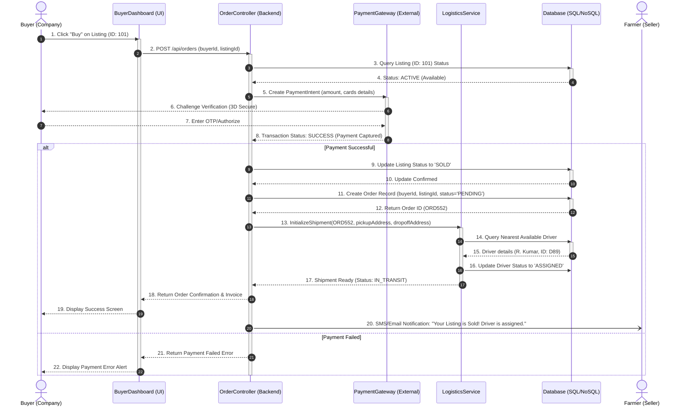

# UML Sequence Diagram - KhaadSeva

This document provides an extensive elaboration of the **Sequence Diagram** for the **KhaadSeva** platform. It illustrates how objects and actors interact in a sequential timeframe to complete a transaction: purchasing agricultural waste and initiating logistics tracking.

---

## 1. Scenario Description: purchasing Agro-Waste
This diagram describes the sequential process that occurs when:
1. A **Buyer** browses the listings and clicks **Buy** on a waste item (e.g., Rice Husk).
2. The platform processes the order and coordinates payment.
3. The platform updates inventory status to prevent double buying.
4. The system assigns a **Driver** to transport the materials.
5. The **Farmer** (Seller) is notified that their listing is sold and is in transit.

---

## 2. Participating Objects & Lifelines

The lifelines represent the objects or actors active during the interaction sequence.

| Lifeline | Type | Description |
| :--- | :--- | :--- |
| **Buyer** | Actor | The company rep initiating the waste purchase. |
| **BuyerDashboard** | Boundary (UI) | The frontend interface displaying listings and accepting user actions. |
| **OrderController** | Controller | API route handler processing order creation. |
| **PaymentGateway** | Service | External entity (e.g., Stripe, Razorpay) processing the fund transfer. |
| **LogisticsService** | Controller / Service | Backend class matching shipments with local drivers and triggering maps routing. |
| **Database** | Entity Store | Storage layer updating listing status and saving order records. |
| **Farmer** | Actor | The seller receiving notification and tracking. |

---

## 3. Sequence Diagram (Mermaid)

Below is the sequence diagram indicating message passing, synchronous calls, and return results.

---

## 4. Message Flow Explanations

1. **Synchronous Messages (Solid line with solid arrowhead)**:
   - Steps 2, 3, 5, 9, 11 represent synchronous calls where the caller waits for a response before proceeding. For example, the backend cannot update the database or assign a driver until the payment gateway confirms the transaction is successful.
2. **Asynchronous Messages (Solid line with open arrowhead)**:
   - Step 20 (`OC -) Farmer`) is asynchronous. The system sends an email/SMS notification to the farmer in the background, allowing the buyer's frontend to immediately display the confirmation page without waiting for notification dispatches to resolve.
3. **Alternative Path (`alt/else` blocks)**:
   - If payment fails, steps 9 through 20 are bypassed. Instead, the control flow transitions directly to steps 21 and 22, notifying the user of the failure and leaving the listing status unchanged as `ACTIVE` so others can purchase it.

---

## 5. Implementation Guidelines for Students
To map this sequence into code:
- **Transactional Safety (Database)**: Implement database transactions (e.g., `pg-promise` transactions or Prisma's `$transaction`) when updating the listing status and creating the order. If the system fails to assign a driver or write the order, the payment should roll back or listings should not remain in a lock-up state.
- **Webhook Integration**: Real-world payment flows often use webhooks. Instead of the synchronous `PaymentGateway -> OrderController` return, configure a `/api/webhooks/payment` endpoint to handle async payment notifications from Stripe or Razorpay.
- **State Machine**: Implement a state machine for order processing (Pending $\rightarrow$ Paid $\rightarrow$ Dispatched $\rightarrow$ In Transit $\rightarrow$ Delivered) to ensure status changes follow legal transitions.
